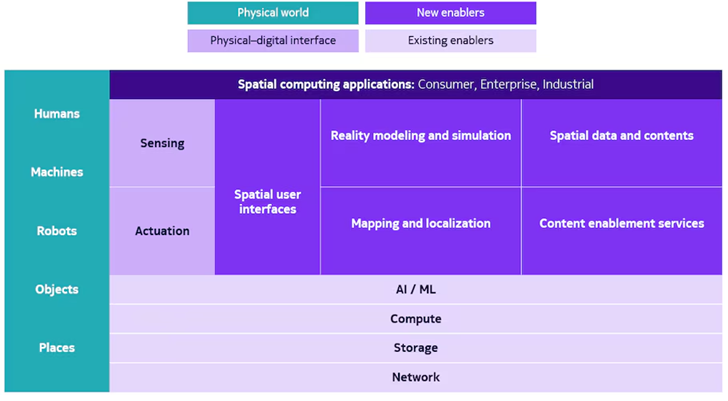

# Sadrushya(सादृश्य)

**Sadrushya** is an open-source initiative focused on **Spatial Intelligence**: building AI systems that understand and generate the 3D physical world from 2D images and sensor data.

> *"The next frontier of AI isn't just generating text or images; it's understanding and generating the 3D physical world."* — Adapted from Fei-Fei Li's "Spatial Intelligence".

---

## Vision

Most AI work today focuses on text and 2D images. The next valuable frontier is **AI that understands space, geometry, and the physical world**.

Sadrushya focuses on **consulting-grade, monetizable Spatial AI domains** using **low-compute, open-source approaches**:

- **Photogrammetry & 3D Reconstruction** (Core Focus: Images → Editable 3D Worlds)
- **Aerial Intelligence** (Agriculture surveillance, Drone-based 3D mapping)
- **3D Scene Intelligence** (Digital Twins, SLAM, Robotics Navigation)

**Why this domain?**
* **Unsaturated Market:** High demand in "Real World AI" (Robotics, Digital Twins, Agriculture, Defense, Gaming/Metaverse) vs. generic Chatbots.
* **Compute Efficient:** Relies on **Geometric Deep Learning**, **Photogrammetry**, and **Edge Inference** (OpenVINO, TinyML) rather than massive GPU clusters required for training LLMs.
* **Global & Local Potential:** Massive scope in India (AgriTech, Infrastructure, Cultural Heritage Preservation) and globally (Metaverse, Architecture/AEC, E-commerce 3D Catalogs).

> *"Spatial intelligence moves beyond both 1D sequences (text) and 2D images or videos by embedding AI's understanding directly into a 3D framework. While a 2D image or video can show a visual representation of a scene, it lacks depth perception and real-world interactive capabilities. Conversely, spatial intelligence uses 3D and even 4D (adding time) contexts to build environments where AI can dynamically perceive, reason, and act."* — [Sanjeev Arora](https://medium.com/second-level-thinking/emerging-technology-spatial-intelligence-unlocking-3d-understanding-in-ai-d29e1c37d7c9)

---

## 🏗 Core Themes

### Theme 1: Micro-Spatial Intelligence — Photogrammetry & 3D World Construction (PRIMARY FOCUS)
**Focus:** Converting 2D images into editable 3D models and scenes using photogrammetry, neural rendering, and geometric deep learning.

* **The "Why":** Inspired by [World Labs](https://www.worldlabs.ai/) (Fei-Fei Li's venture), we're building the capability to reconstruct 3D editable worlds from ordinary images. This enables applications from personal object modeling to architectural visualization, cultural heritage preservation, and immersive content creation.

* **Key Applications:**
  - **Personal 3D Modeling:** Convert 30-40 photos of a statue, toy, or object into a 3D mesh (OBJ/STL/USD format)
  - **House Design & Real Estate:** Room scanning and 3D floor plan generation
  - **Cultural Heritage:** Digital preservation of monuments and artifacts
  - **E-commerce:** 3D product catalogs from simple photo shoots
  - **Gaming/XR:** Asset creation for virtual worlds

* **Technical Pipeline:**
  1. **Image Collection:** 30-40 images captured from multiple angles
  2. **Object Detection & Segmentation:** YOLO/SAM for isolating subject
  3. **Feature Extraction & Matching:** SIFT/ORB/SuperPoint for correspondences
  4. **Structure from Motion (SfM):** Camera pose estimation and sparse point cloud
  5. **Multi-View Stereo (MVS):** Dense 3D reconstruction
  6. **Mesh Generation:** Poisson surface reconstruction or neural implicit surfaces
  7. **Texture Mapping:** UV unwrapping and texture baking
  8. **Export:** OpenUSD, OBJ, STL, or Unity-compatible formats

* **Modality:** Multi-view 2D Images → 3D Editable Meshes/Scenes

* **Monetization Strategy:**
  - **MCP Server/API:** Process limited images (10-15) for free
  - **Android App:** Freemium model with paid tier for high-res reconstruction (40+ images)
  - **B2B Consulting:** Custom solutions for architecture, heritage, retail

### Theme 2: Macro-Spatial Intelligence — Aerial & Drone-based Reconstruction
**Focus:** Aerial, Drone, and Satellite Imagery converted into 3D terrain models and actionable insights.

* **The "Why":** Analyzing the world from above. Critical for Agriculture (India's backbone), Defense, Urban Planning, and Infrastructure Monitoring.

* **Key Applications:**
  - **Precision Agriculture:** Crop health monitoring, yield prediction
  - **Terrain Mapping:** 3D topographic models from drone footage
  - **Infrastructure Inspection:** Bridges, power lines, construction sites
  - **Disaster Response:** Rapid 3D damage assessment

* **Technical Focus:**
  - Real-time object detection (YOLO on edge devices)
  - Video-to-3D world reconstruction from drone footage
  - SLAM for autonomous navigation
  - Sensor fusion (RGB + LiDAR + Thermal)

* **Modality:** Aerial Video/Images → Geo-tagged 3D Worlds + Analytics

### Theme 3: Robotics & Real-time Spatial Understanding
**Focus:** Real-time perception, navigation, and 3D world modeling for autonomous systems.

* **Key Technologies:**
  - **SLAM** (Simultaneous Localization and Mapping)
  - **Real-time Object Detection** (YOLO on NVIDIA Jetson/Arduino)
  - **Sensor Integration** (LiDAR, Depth Cameras, IMU)
  - **Path Planning** & Navigation (ROS/ROS2)

* **Learning Path:**
  - Master OpenCV, PyTorch3D, LiDAR processing
  - Build with Arduino, Raspberry Pi, NVIDIA Jetson
  - Implement SLAM algorithms (ORB-SLAM3, RTABMap)

---

## 🛠 Open Source Tech Stack (Low-Compute/Edge Focus)

| Layer | Tools & Libraries | Usage |
| :--- | :--- | :--- |
| **Photogrammetry** | **COLMAP**, **OpenMVG**, **Meshroom** (AliceVision) | Structure from Motion, Multi-View Stereo |
| **Neural 3D** | **NeRF**, **Gaussian Splatting**, **Instant-NGP** | Neural scene representations |
| **3D Processing** | **PyTorch3D**, **Kaolin** (NVIDIA), **Open3D**, **Trimesh** | Mesh processing, point clouds, geometric deep learning |
| **Object Detection** | **YOLOv8/v11** (Nano/Small), **SAM** (Segment Anything) | Subject isolation and segmentation |
| **Scene Description** | **OpenUSD** (Universal Scene Description) | The HTML of 3D; essential for interoperability |
| **Inference/Edge** | **Intel OpenVINO**, **ONNX Runtime**, **TensorRT** | Deploy models on CPUs/Edge devices |
| **Vision (2D)** | **OpenCV**, **Pillow**, **scikit-image** | Image processing and feature extraction |
| **Robotics** | **ROS/ROS2**, **NVIDIA Jetson**, **Arduino** | Robot navigation, sensor integration |
| **LLM/VLM Integration** | **LangChain**, **LangGraph**, **Agno** | Building intelligent agents for 3D workflows |
| **3D Viewers** | **Three.js**, **Babylon.js**, **Blender** | Web/desktop 3D visualization |

---

## 📚 Tutorial Roadmap

### Phase 1: Fundamentals (Weeks 1-4)
- [ ] **Tutorial 1:** Image feature extraction with OpenCV (SIFT, ORB)
- [ ] **Tutorial 2:** Camera calibration and pose estimation
- [ ] **Tutorial 3:** Point cloud processing with Open3D
- [ ] **Tutorial 4:** Basic mesh operations with PyTorch3D

### Phase 2: 3D Reconstruction Pipeline (Weeks 5-8)
- [ ] **Tutorial 5:** Structure from Motion with COLMAP (Given 30-40 statue images)
- [ ] **Tutorial 6:** Dense reconstruction with Multi-View Stereo
- [ ] **Tutorial 7:** Mesh generation and texturing
- [ ] **Tutorial 8:** Export to OpenUSD, OBJ, STL formats

### Phase 3: Neural Methods (Weeks 9-12)
- [ ] **Tutorial 9:** Introduction to NeRF (Neural Radiance Fields)
- [ ] **Tutorial 10:** Gaussian Splatting for real-time rendering
- [ ] **Tutorial 11:** Instant-NGP for fast training
- [ ] **Tutorial 12:** Photogrammetry with Transformers

### Phase 4: Production & Deployment (Weeks 13-16)
- [ ] **Tutorial 13:** Building an MCP server for 3D reconstruction API
- [ ] **Tutorial 14:** Android app development for mobile 3D scanning
- [ ] **Tutorial 15:** Edge deployment with OpenVINO
- [ ] **Tutorial 16:** Integrating LLMs for intelligent 3D asset generation

### Phase 5: Advanced Applications (Weeks 17-20)
- [ ] **Tutorial 17:** Drone video to 3D world reconstruction
- [ ] **Tutorial 18:** Real-time object detection with YOLO on Jetson
- [ ] **Tutorial 19:** SLAM implementation for robotics
- [ ] **Tutorial 20:** LiDAR + RGB fusion for outdoor scenes

---

## 🎯 Starter Project: Statue Reconstruction

**Goal:** Given 30-40 images of a statue, automatically generate a 3D mesh file.

### Step-by-Step Implementation:

```python
# Pipeline Overview
1. Image Collection (30-40 photos from different angles)
2. Object Segmentation (YOLO/SAM to isolate statue)
3. Feature Matching (COLMAP for camera poses)
4. Dense Reconstruction (MVS algorithms)
5. Mesh Generation (Poisson reconstruction)
6. Texture Mapping (UV unwrapping)
7. Export (OpenUSD/OBJ/STL)
```

**Code Structure:**
```
statue-reconstruction/
├── data/
│   └── input_images/       # 30-40 statue images
├── src/
│   ├── preprocess.py       # Image preprocessing & segmentation
│   ├── sfm.py             # Structure from Motion (COLMAP wrapper)
│   ├── mvs.py             # Multi-View Stereo
│   ├── mesh.py            # Mesh generation & texturing
│   └── export.py          # Export to various formats
├── models/
│   └── yolo_weights/      # Pre-trained YOLO models
├── output/
│   ├── sparse/            # Sparse point cloud
│   ├── dense/             # Dense point cloud
│   └── mesh/              # Final 3D mesh (OBJ, STL, USD)
├── requirements.txt
└── README.md
```

**Deliverables:**
- Working code repository with example dataset
- MCP server API for reconstruction service
- 3D viewer (Three.js) for web visualization
- Android app prototype (freemium model)

---

## 🚀 Business Model & Roadmap

### Free Tier
- MCP Server API: 10-15 images, standard resolution
- Community tutorials and code
- Web-based 3D viewer

### Paid Tier (Android App)
- 40+ high-resolution images
- Advanced mesh optimization
- Multiple export formats (OpenUSD, FBX, Unity)
- Cloud storage for 3D assets
- Priority processing

### Consulting Services
- Custom 3D reconstruction for enterprises
- Cultural heritage digitization projects
- Architectural visualization pipelines
- E-commerce 3D catalog generation

---

## 📐 Architecture

 *by [Nokia](https://www.nokia.com/innovation/technology-vision/on-the-road-to-spatial-computing/)*

At its foundation, the physical world (represented in green) encompasses humans, machines, robots, objects, and places, supported by existing enablers (light purple) such as networks, storage, compute resources, and AI/ML capabilities. The framework introduces five crucial new enabling technologies (dark purple): spatial user interfaces, mapping and localization systems, reality modeling and simulation tools, spatial data and contents, and content enablement services.

**Sadrushya's Position in the Stack:**
- **Reality Modeling & Simulation:** Core focus on photogrammetry and 3D reconstruction
- **Spatial Data & Contents:** Generating 3D assets and scene descriptions (OpenUSD)
- **Content Enablement Services:** APIs and tools for developers (MCP server)

---

## 🔗 References & Influencers

### Research & Vision
* **Fei-Fei Li:** For the vision of Spatial Intelligence and World Labs
  - [With Spatial Intelligence, AI Will Understand the Real World | TED](https://www.youtube.com/watch?v=y8NtMZ7VGmU)
  - ["The Future of AI is Here" — Fei-Fei Li Unveils the Next Frontier of AI](https://www.youtube.com/watch?v=vIXfYFB7aBI)
  - [Spatial Intelligence is the Next Frontier in AI](https://www.youtube.com/watch?v=_PioN-CpOP0)
  - [The Godmother of AI on jobs, robots & why world models are next](https://www.youtube.com/watch?v=Ctjiatnd6Xk)

### Technical Leaders
* **NVIDIA Omniverse Team:** OpenUSD and Industrial Digital Twins
* **Florent Poux:** 3D Point Cloud processing tutorials
* **Justin Johnson:** PyTorch3D researcher
* **Ben Mildenhall:** NeRF pioneer
* **Christoph Lassner:** 3D and 4D perception researcher
* **Matthew Tancik:** Head of Applied Research at Luma AI

### Key Repositories to Study
* `COLMAP` — Gold standard for photogrammetry
* `Meshroom` — Open-source photogrammetry pipeline
* `Instant-NGP` — Fast neural graphics primitives
* `Gaussian-Splatting` — Real-time neural rendering
* `PointNet++` — Point cloud deep learning
* `Kaolin` — NVIDIA's 3D deep learning library
* `DeepFloorplan` — 2D to 3D architectural conversion

### Research Labs & Communities
* **Geo-Intel Lab:** [Geospatial Intelligence](https://geo.intel.iittnif.com/) — Remote Sensing, GNSS, PNT, Digital Twins
* **World Labs:** Fei-Fei Li's spatial intelligence startup
* **OpenUSD Alliance:** Pixar, NVIDIA, Apple, Autodesk

---

## 🎓 Learning Path & Content Strategy

### Content Creation Plan
1. **Tutorial Videos:** Step-by-step photogrammetry pipelines
2. **Instagram Reels:** Quick tips on 3D reconstruction
3. **IITM Collaborations:** Academic projects and research
4. **Blog Posts:** Deep dives into algorithms
5. **GitHub Examples:** Runnable code for each tutorial

### Skills to Master
- **Computer Vision:** OpenCV, feature matching, camera calibration
- **3D Geometry:** PyTorch3D, mesh processing, point clouds
- **Photogrammetry:** COLMAP, Meshroom, MVS algorithms
- **Neural Methods:** NeRF, Gaussian Splatting, Transformers
- **Robotics:** ROS, SLAM, sensor fusion (LiDAR + RGB)
- **Edge Computing:** OpenVINO, TensorRT, NVIDIA Jetson
- **Hardware:** Arduino, Raspberry Pi, depth cameras

---

## 🤝 Contributing

We welcome contributions in:
- Tutorial development
- Code examples and benchmarks
- Documentation improvements
- Dataset curation (with proper licensing)
- Algorithm implementations

---

## 📄 License

This project is open-source under the MIT License. Individual tutorial code may have additional attributions.

---

**Join us in building the future of Spatial Intelligence — one image at a time! 🌍✨**